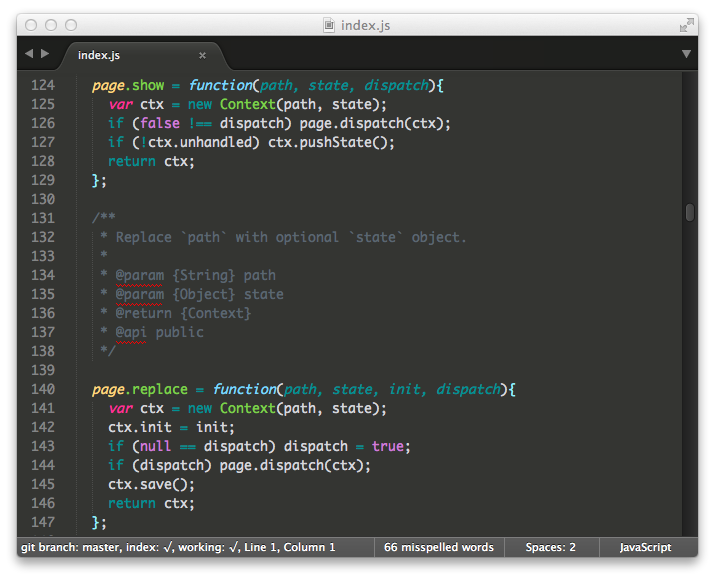

#Aethusa

***Daughter of Poseidon | Theme of bosses***

Textmate & Sublime Text 2/3 Theme

Based on [Deep Blue See](https://github.com/jisaacks/DeepBlueSee/) by [JD Isaacks](https://github.com/jisaacks)

##Installing

Sublime Text 2:

* Windows: `%APPDATA%\Sublime Text 2\Packages`

* OS X: `~/Library/Application\ Support/Sublime\ Text\ 2/Packages`

* Linux: `~/.config/sublime-text-2/Packages`

Sublime Text 3:

* Windows: `%APPDATA%\Sublime Text 3\Packages`

* OS X: `~/Library/Application\ Support/Sublime\ Text\ 3/Packages`

* Linux: `~/.config/sublime-text-3/Packages`

Then, go into Sublime Text 2/3 preferences, go to Choose Scheme and select Aethusa.

Textmate 2:
    
    ~/Library/Application\ Support/Avian/Bundles/themes

Textmate:
    
    ~/Library/Application\ Support/TextMate/Themes

Then, go into TextMate’s preferences, choose the Fonts & Colors tab and choose "Aethusa" from the drop-down menu.

If you're a Vim User, see:

[Aethusa-vim](https://github.com/afj176/Aethusa-vim)

If you're a Atom.io User, see:

[Aethusa-atom](https://github.com/afj176/Aethusa-atom)
